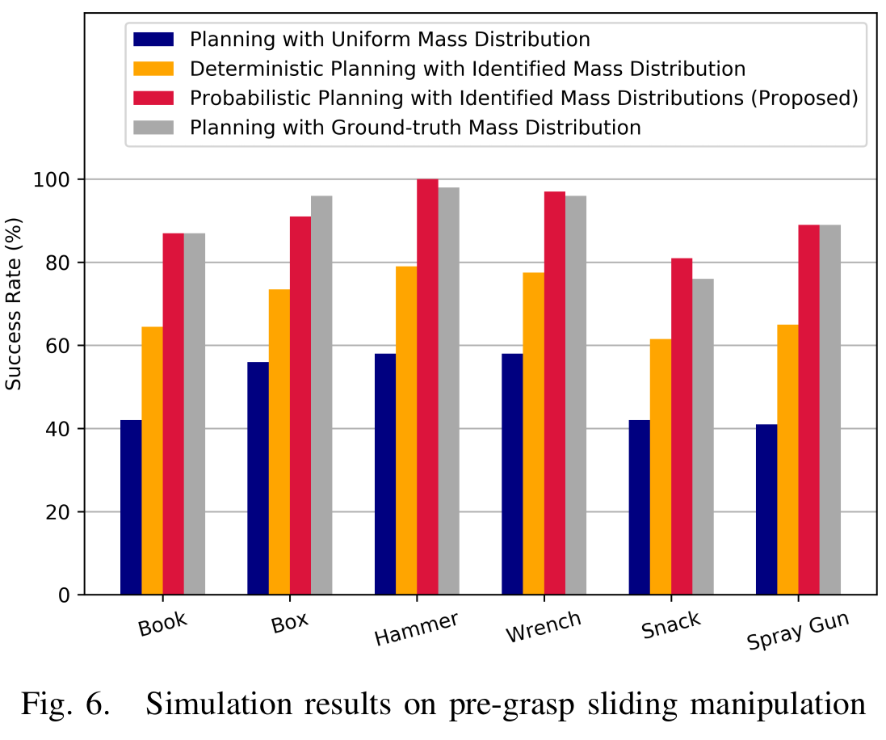
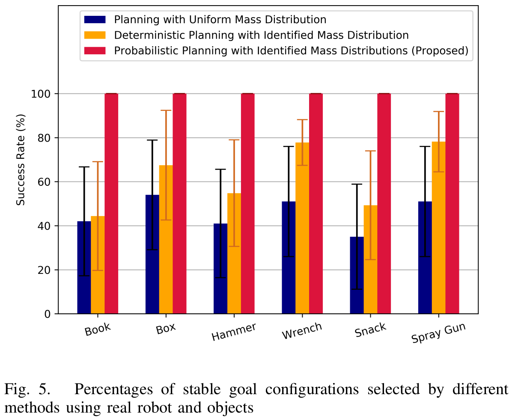
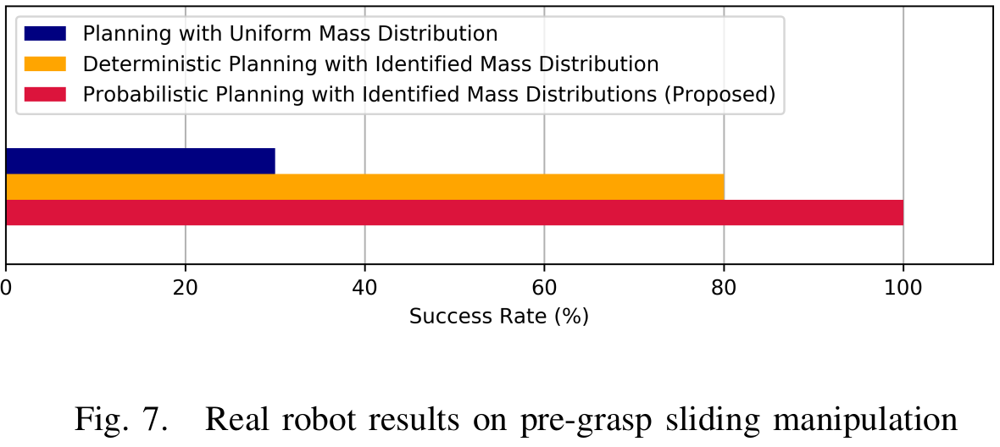

# A Probabilistic Model for Planar Sliding of Objects with Unknown Material Properties

Changkyu Song and Abdeslam Boularias, A Probabilistic Model for Planar Sliding of Objects with Unknown Material Properties, IEEE/RSJ International Conference on Intelligent Robots and Systems (IROS 2020), Oct. 25-29th, 2020, Las Vegas, Nevada, USA [[PDF]](https://drive.google.com/file/d/1WgOIUkrSHKwQCo7SPcp0rxSQefX7GKNH/view?usp=sharing) [[Video]](https://www.youtube.com/watch?v=RIwDceAbpG8)

This paper introduces a new technique for learning probabilistic models of mass and friction distributions of unknown objects, and performing robust sliding actions by using the learned models. The proposed method is executed in two consecutive phases. In the exploration phase, a table-top object is poked by a robot from different angles. The observed motions of the object are compared against simulated motions with various hypothesized mass and friction models. The simulation-to-reality gap is then differentiated with respect to the unknown mass and friction parameters, and the analytically computed gradient is used to optimize those parameters. Since it is difficult to disentangle the mass from the friction coefficients in low-data and quasi-motion regimes, our approach retains a set of locally optimal pairs of mass and friction models. A probability distribution on the models is computed based on the relative accuracy of each pair of models. In the exploitation phase, a probabilistic planner is used to select a goal configuration and waypoints that are stable with a high confidence. The proposed technique is evaluated on real objects and using a real manipulator. The results show that this technique can not only identify accurately mass and friction coefficients of non-uniform heterogeneous objects, but can also be used to successfully slide an unknown object to the edge of a table and pick it up from there, without any human assistance or feedback.

# Results

